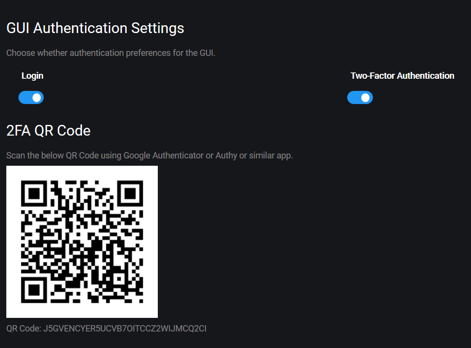

# Autenticação

## Password

A primeira vez que visitar o GUI do Gunbot no browser, é pedido para registar a sua palavra-passe.

## Two factor authentication \(2FA\)

Gunbot suporta autenticação com 2 factores \(2FA\) utilizando o Google Authenticator, Authy ou aplicações similares..

Para activar o 2FA, ir a **Settings** &gt; **Authentication**.

