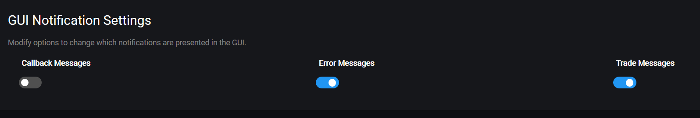

# Notificações do GUI

## Parâmetros do GUI

O menu GUI Notifications permite alterar quais as notificações que são visíveis.

Para alterar, ir a **Settings** &gt; **GUI Notifications**.

## Descrição dos parâmetros

Abaixo irá encontrar descrições detalhados dos parâmetros disponiveis para o menu bot. Alguns parâmetros avançados apenas estão disponíveis através do ficheiro `config.js` .

### Mensagens de Callback



Definir como true para receber notificações callback no GUI.



**Valores:** true ou false

**Valor por defeito:** false



Nome do parâmetro em `config.js`: `callback`



### Mensagens de Erro



Definir como true para receber notificações de erro no GUI.



**Valores:** true ou false

**Valor por defeito:** false



Nome do parâmetro em `config.js`: `error`



### Messagens de Trade



Definir como true para receber notificações de trades no GUI.



**Valores:** true ou false

**Valor por defeito:** false



Nome do parâmetro em `config.js`: `trade`



### Activo \(GUI\)



Definir como false para desactivar o GUI.



**Valores:** true ou false

**Valor por defeito:** false



Nome do parâmetro em `config.js`: `enabled`



### Start



Quando definido como false, o Gunbot inicia o GUI \(Se activado\) mas não inicia o processamento de pares \(ciclos\) até o core ser iniciado através do GUI.

Só é activado após clickarem no botão "**START BOT CORE**" no GUI.

Caso não utilize o GUI, definir este parâmetro como true.



**Valores:** true ou false

**Valor por defeito:** false



Nome do parâmetro em `config.js`: `start`



### Port \(GUI\)



O número da porta do GUI.



**Valores:** numérico - representa o número da porta.

**Valor por defeito:** 5000



Nome do parâmetro em `config.js`: `port`



### Https



Definir como true para correr o GUI somente via https.  
  
Requer uma chave privada e um certificado na pasta do Gunbot.



**Valores:** true ou false

**Valor por defeito:** false



Nome do parâmetro em `config.js`: `https`



### Key



Define o nome do ficheiro da chave privada utilizada para correr o GUI via https.



**Valores:** texto, representa um ficheiro.

**Valor por defeito**_**:**_ localhost.key



Nome do parâmetro em `config.js`: `key`



### Cert



Define o nome do ficheiro do certificado / chave pública utilizado para correr o GUI via https.



**Valores:** texto, representa um ficheiro.

**Valor por defeito:** __localhost.cert



Nome do parâmetro em `config.js`: `cert`



### Networktraffic



Definir como true para visualizar no GUI pedidos de tráfego de rede dos logs do Gunbot.

Útil em caso de debug \(verificações ou erros\).



**Valores:** true ou false

**Valor por defeito:** false



Nome do parâmetro em `config.js`: `networktraffic`



### Login



Definir como true para activar a autenticação com password. A password é definida no GUI.

Caso necessite de efectuar reset à password, definir como false.



**Valores:** true ou false

**Valor por defeito:** false



Nome do parâmetro em `config.js`: `login`



### TwoFA



Definir como true para activar a autenticação com 2 factores \(2FA\). Este setup é feito no GUI.  
  
Caso necessite de efectuar reset ao 2FA, definir como false.



**Valores:** true ou false

**Valor por defeito:** false



Nome do parâmetro em `config.js`: `twoFA`



