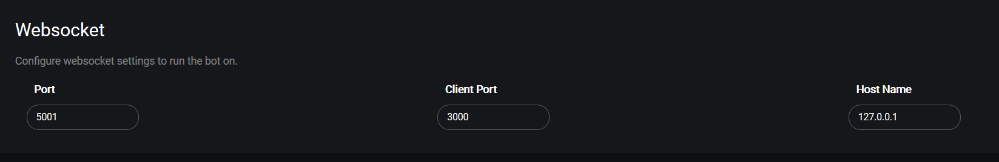

# Websockets

O Gunbot fornece certa data através dos websockets. Documentação limitada para esta funcionalidade está disponível no seguinte repositório: [https://github.com/GuntharDeNiro/Gunthy/\#webgui-informations-for-devs-](https://github.com/GuntharDeNiro/Gunthy/#webgui-informations-for-devs-)

Para alterar os parâmetros de websockets ir a **Settings** &gt; **Websocket**.

## Descrição de parâmetros

Abaixo encontrará descrições detalhadas dos parâmetros disponíveis para websockets.

### Port \(WS\)



Define a porta utilizada para websockets.



**Valores:** numérico - representa o número da porta.

**Valor por defeito:** 5001



Nome do parâmetro em `config.js`: `port`



### Client Port



Pode alterar a porta de cliente para interfaces web de terceiros.



**Valores:** numérico - representa o número da porta.

**Valor por defeito:** 3000



Nome do parâmetro em `config.js`: `clientport`



### Hostname



O Endereço de IP ou nome da máquina \(hostname\) utilizado para websockets. Por defeito é "localhost". Pode ser definido também um IP externo.



**Valores:** texto, representa um endereço ip ou hostname

**Valor por defeito:** 127.0.0.1



Nome do parâmetro em `config.js`: `hostname`



